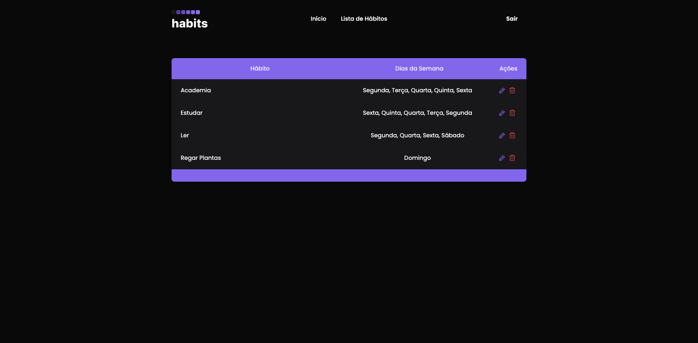

<div align="center" id="top">

</div>

<h1 align="center">NLW Setup - Habits</h1>

<p align="center">
  
</p>

<hr>

<p align="center">
  <a href="#about">Sobre o Projeto</a> &#xa0; | &#xa0;
  <a href="#sparkles-features">Features</a> &#xa0; | &#xa0;
  <a href="#rocket-technologies">Tecnologias</a> &#xa0; | &#xa0;
  <a href="#white_check_mark-requirements">Requerimentos</a> &#xa0; | &#xa0;
  <a href="#checkered_flag-starting">Iniciando</a> &#xa0; | &#xa0;
</p>

<br>

## Sobre o Projeto ##

Habits é um projeto desenvolvido durante o primeiro NLW de 2023 da Rocketseat. A aplicação consiste no gerenciamento e acompanhemento de hábitos durante o ano.

## :sparkles: Features ##

- [x] Criar hábitos
- [x] Listar hábitos
- [x] Marcar hábitos com realizados no dia ou não
- [x] Barra de progresso dos hábitos do dia
- [ ] Editar hábito
- [x] Deletar hábito
- [ ] more...

## :rocket: Tecnologias ##

Foram utilizadas as seguintes tecnologias no projeto:

- [React](https://pt-br.reactjs.org/)
- [TypeScript](https://www.typescriptlang.org/)
- [React-Query](https://tanstack.com/query/latest/)
- [Radix UI](https://www.radix-ui.com/)
- [Tailwind CSS](https://tailwindcss.com/)


## :white_check_mark: Requerimentos ##

Antes de iniciar :checkered_flag:, você precisa ter instalado:

- [Git](https://git-scm.com)
- [Node](https://nodejs.org/en/)

### Configure a variável de ambiente .env ###

```json
VITE_API_BACKEND="https://nlw-setup-zokt.onrender.com"
```

## :checkered_flag: Starting ##

```bash
# Clone o repositório
$ git clone git@github.com:eduardomuchak/nlw-setup-frontend.git

# Acesse o diretório raiz do projeto
$ cd nlw-setup-frontend

# Instale as dependências
$ npm i 

# Rode o projeto
$ npm rum dev 

```

## Telas

<div align="center" id="web">
  

  

  

  &#xa0;

  <!-- <a href="https://nlw-11-habits.netlify.app">Demo</a> -->
</div>

<a href="#top">Back to top</a>